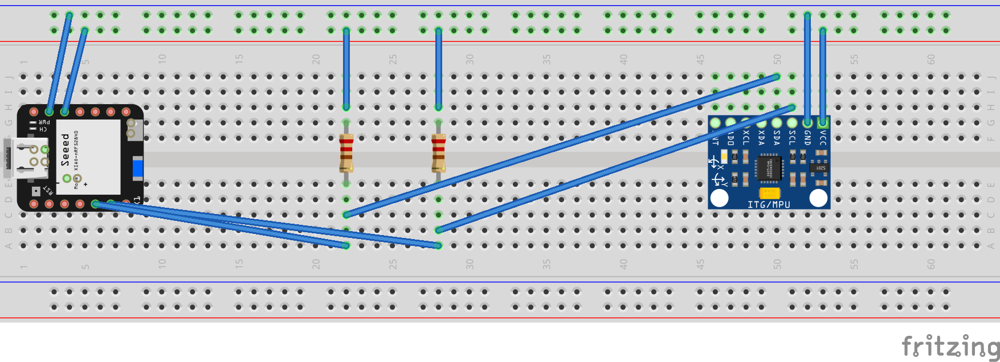
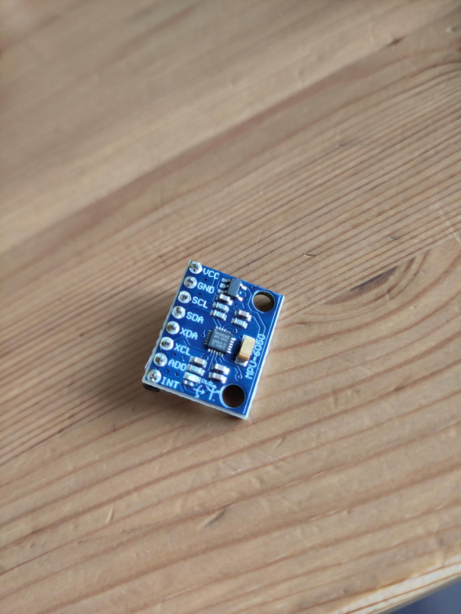

# Let's write an embassy project: I2C IMU

In this project you will learn how to use the I2C bus to communicate with an IMU (Inertial Measurement Unit) sensor. You will also learn how to find the correct driver library for the sensor you are using and read sensor data with it.

You then can then for example calculate the current orientation of the device, or let an LED blink, if the rotational speed is above a certain threshold.

But that's up to you :)

## Setup

Setup

```sh
esp-generate --chip esp32c3 --headless -o probe-rs -o defmt -o embassy -o unstable-hal i2c_imu
```

<details>
<summary>If you use an ESP32s3:</summary>
<br>

[Source](https://github.com/esp-rs/espup?tab=readme-ov-file#quickstart)

```sh
esp-generate --chip esp32s3 --headless -o probe-rs -o defmt -o embassy -o unstable-hal i2c_imu
```

Install Xtensa toolchain

```sh
espup install --targets=esp32s3
```

Source the toolchain into your environment

```sh
source ~/export-esp.sh
```
</details>

Build and flashing

```sh
cargo run --release
```

## What is I2C?

Serial Protocol to transfer data. Needs two signals: `SDA` and `SCL` (Serial Data and Serial Clock). Together they build and transfer data between a start signal (S) and a stop signal (P)

To show the data transfer, we can use a diagram.


<sub>Image source: [Wikipedia](https://de.wikipedia.org/wiki/I%C2%B2C#/media/Datei:I2C_data_transfer.svg)</sub>

Within the start (S) and stop (P) signal we can transfer data bits.

Interesting to know is that i2c is a so called master-slave protocol. Meaning, that the master initiates the communication - and the slave(s) respond to the master's requests.

In this case our MCU is the master (that also generates the clock signal) and the peripheral is the slave.

The speeds we can achieve are:

- 100kHz (Standard Mode, 100kbit/s)
- 400kHz (Fast Mode, 400kbit/s)
- 1MHz (Fast Mode Plus, 1Mbit/s)
- 3.4MHz (High Speed Mode, 1.7-3.4 Mbit/s)

More info to i2c you can find [at Wikipedia](https://en.wikipedia.org/wiki/I%C2%B2C).

## How to wire i2c with the ESP32



Note: The two pull-up registers in this diagram are very likely redundant since almost all I2C breakout board include them already. But if you
put resistors like in the diagram, use 4.7k Ohms resistors, to make the I2C work.

## Finding a driver for given IMU

If you are not familiar with cargo crates, you can have a look at [crates.io](https://crates.io/) and type in `mpu6050`, as this is the sensor we are using.

As we also use the quite new `embedded-hal` crate - it is beneficial, if you filter the found crates for `Recent Updates`.

You then add the crate with cargo

```sh
cargo add <crate-you-found>
```

## Try to implement it yourself

You will find plenty of examples in the crates you chose to for this project.

**Note**: If happen to have an IMU like shown in the image below - those hang up, if you calibrate them.
Just leave the calibration out, reading values works.



Netherless: here are some hints, if you get stuck somewhere:

<details>
<summary>What to do/try:</summary>
<br>

This should be your steps:

1. Find a crate that supports the MPU6050 sensor.
2. Look at the examples they provide - maybe you get a hang of how this works
3. Initialize an i2c connection using the crate.
4. Read the sensor data using the crate.

</details>

<details>
<summary>The crate to use:</summary>
<br>

We found those two crates useful:

- [mpu6050](https://crates.io/crates/mpu6050)
- [mpu6050-dmp](https://crates.io/crates/mpu6050-i2c)

Note: The _mpu6050_ crate is a bit dated. If you want to use it, make sure you directly
use the master branch of it. Atleast this version complies to `embedded-hal` >= 1.
We recommed to go for the _mpu6050-dmp_ crate, as it provides a more complete examples and
also supports asynchronous operations.

E.g. Installing the `mpu6050-dmp` crate

```sh
cargo add mpu6050-dmp -F async -F defmt-03
```

</details>

<details>
<summary>Initializing an i2c connection:</summary>
<br>

```rust
let i2c_config = Config::default().with_frequency(Rate::from_khz(400));
let i2c = I2c::new(peripherals.I2C0, i2c_config)
    .expect("Failed to initialize I2C")
    .with_sda(peripherals.GPIO5)
    .with_scl(peripherals.GPIO6)
    .into_async();
```

</details>

If you get totally lost, we provided you a possible solution at `code/i2c_imu_s3` (esp32s3) or `code/i2c_imu_c3` (esp32c3), where we calibrate the IMU and read the sensor data. You can also use this one, if you want to continue building something bigger on it.

You can also ask us and others for help!
