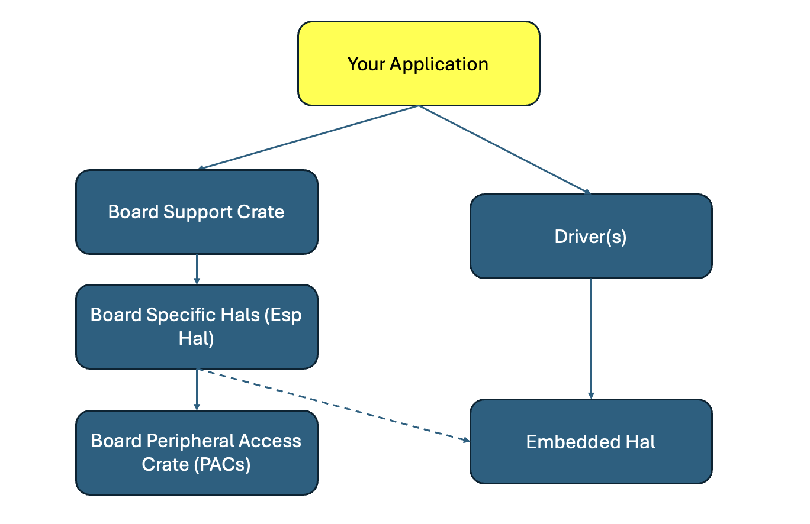

# Overview on embedded software



- You application that uses different drivers
- The drivers depend on the embedded_hal
- embedded_hal(_async): for platform agnostic drivers
- Your specific board—that implements the embedded_hal traits. For example esp_hal.
- PACs: The peripheral access crate is a safe rust wrapper around low level memory mapped registers. They are generated from System View Descriptions (SVD) files, describing the register map for each peripheral (GPIO, ADC, I2C etc.). SVDs are given from the manufacturer.

## What's a Hardware Abstraction Layer (HAL)?

Abstracts away hardware specifics - e.g. GPIO pins, Timers etc.

```rust
use esp_hal::clock::CpuClock;
use esp_hal::gpio::{Level, Output, OutputConfig};
use esp_hal::main;
use esp_hal::time::{Duration, Instant};

// ... main

    let config = esp_hal::Config::default().with_cpu_clock(CpuClock::max());
    let peripherals = esp_hal::init(config);

    // GPIO 10 is labeled D10 on the Seed Xiao board
    let mut led = Output::new(peripherals.GPIO10, Level::Low, OutputConfig::default());
```

## How can you use Drivers, that use embedded_hal?

As an example:
[Nerd-Neck](https://github.com/yguenduez/nerd-neck):

- Uses `bmi160` (6DoF - Internal Measurement Unit) crate. Driver, that uses embedded_hal and is platform agnostic. The constructor/factory function [intializes
with HAL peripherals (i.e. I2C)](https://github.com/eldruin/bmi160-rs/blob/master/src/device_impl.rs#L10)
- Uses esp32s3, i.e. [esp_hal I2C, that implement embedded_hal](https://github.com/yguenduez/nerd-neck/blob/main/nerd-neck/src/bmi160_adapter.rs#L13)

## Further Sources

- [Comprehensive-Rust](https://google.github.io/comprehensive-rust/bare-metal.html)
- [Ferrocene Training Slides](https://rust-training.ferrous-systems.com/latest/slides/)
